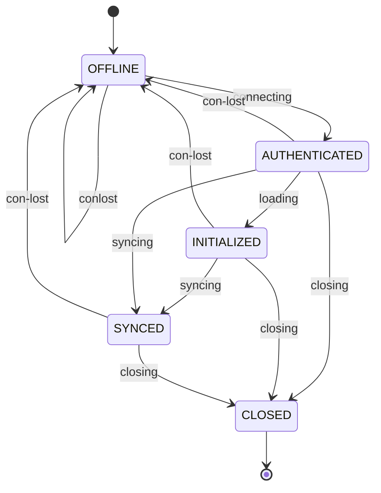
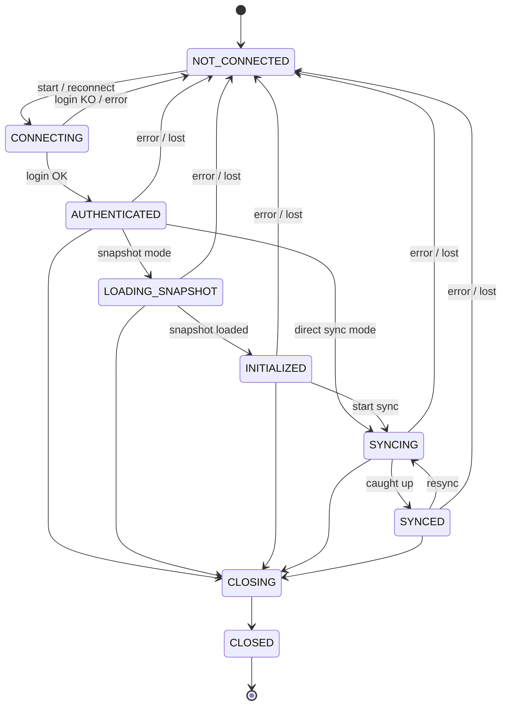
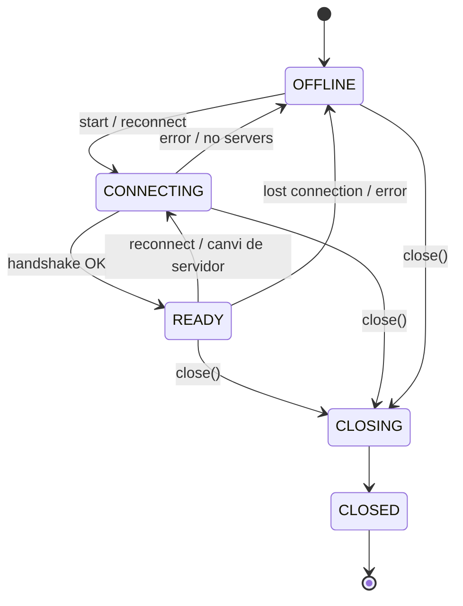

# Nplex client states

## COCO

```mermaid
stateDiagram-v2
    [*] --> OFFLINE

    OFFLINE --> OFFLINE                : conlost
    OFFLINE --> AUTHENTICATED          : connecting
    AUTHENTICATED --> INITIALIZED      : loading
    INITIALIZED --> SYNCED             : syncing
    AUTHENTICATED --> SYNCED           : syncing
    AUTHENTICATED --> CLOSED           : closing
    INITIALIZED --> CLOSED             : closing
    SYNCED --> CLOSED                  : closing
    AUTHENTICATED --> OFFLINE          : con-lost
    INITIALIZED --> OFFLINE            : con-lost
    SYNCED --> OFFLINE                 : con-lost

    CLOSED --> [*]
```

## Estats interns (`state_e`)

```mermaid
stateDiagram-v2
    [*] --> NOT_CONNECTED

    NOT_CONNECTED --> CONNECTING      : start / reconnect
    CONNECTING --> AUTHENTICATED      : login OK
    CONNECTING --> NOT_CONNECTED      : login KO / error

    AUTHENTICATED --> LOADING_SNAPSHOT    : snapshot mode
    AUTHENTICATED --> SYNCING             : direct sync mode

    LOADING_SNAPSHOT --> INITIALIZED      : snapshot loaded
    INITIALIZED --> SYNCING               : start sync

    SYNCING --> SYNCED                    : caught up
    SYNCED --> SYNCING                    : resync

    AUTHENTICATED --> CLOSING
    LOADING_SNAPSHOT --> CLOSING
    INITIALIZED --> CLOSING
    SYNCING --> CLOSING
    SYNCED --> CLOSING

    CLOSING --> CLOSED
    CLOSED --> [*]

    %% Errors / pèrdua connexió
    AUTHENTICATED --> NOT_CONNECTED       : error / lost
    LOADING_SNAPSHOT --> NOT_CONNECTED    : error / lost
    INITIALIZED --> NOT_CONNECTED         : error / lost
    SYNCING --> NOT_CONNECTED             : error / lost
    SYNCED --> NOT_CONNECTED              : error / lost
```

## Estats agregats exposats a l'usuari

```mermaid
stateDiagram-v2
    [*] --> OFFLINE

    OFFLINE --> CONNECTING    : start / reconnect
    CONNECTING --> READY      : handshake OK
    CONNECTING --> OFFLINE    : error / no servers

    READY --> CONNECTING      : reconnect / canvi de servidor
    READY --> OFFLINE         : lost connection / error

    READY --> CLOSING         : close()
    CONNECTING --> CLOSING    : close()
    OFFLINE --> CLOSING       : close()

    CLOSING --> CLOSED
    CLOSED --> [*]
```